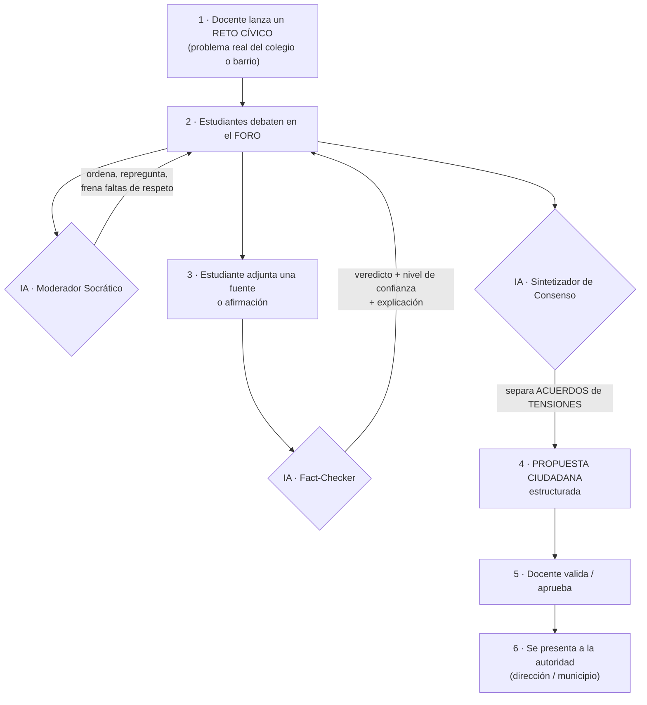

# YariNET — Marco Teórico y Posicionamiento

Módulo de deliberación cívica asistida por IA para colegios · Plataforma Cumbre
Educatón Challenge 2026

---

## 1. Definición de YariNET

**Frase que lo define:**

> **YariNET es un foro de debate cívico para colegios donde una IA actúa como moderadora imparcial: ordena la discusión, verifica las fuentes en tiempo real y convierte el desacuerdo en una propuesta ciudadana concreta.**

**Posicionamiento (identidad):**

> No solo formamos *agentes de cambio* — formamos **constructores de acuerdos**: estudiantes capaces de convertir el desacuerdo en consenso, y el consenso en propuesta.

La IA no decide quién tiene la razón. Es un **cartógrafo, no el viajero**: dibuja el terreno —perspectivas, evidencia y consecuencias— para que el estudiante decida con criterio. La decisión final siempre es humana.

---

## 2. Problema central

La educación cívica escolar en el Perú es **teórica y pasiva**, y los estudiantes —aun estando motivados y con espacios de debate— **no logran deliberar de forma efectiva**: sus discusiones colapsan en el momento del desacuerdo.

> **El debate estudiantil no fracasa por falta de espacio ni de ganas — fracasa en el momento del desacuerdo.** Cuando las opiniones chocan, no hay quién modere, entra desinformación sin filtro, y la discusión termina en conflicto, sin acuerdo y sin resultado.

**Tres causas raíz:**
1. No hay **moderación imparcial** que ordene la discusión y exija argumentar.
2. Entra **desinformación** (redes/influencers) al debate sin validarse.
3. No existe un **método para convertir el desacuerdo en consenso** y en propuesta.

**Consecuencia:** deliberar se vuelve frustrante → se erosiona la agencia ("mejor lo dejamos ahí"), y el estudiante aprende que participar no sirve.

*Evidencia de la entrevista (Mariana, 16, 5.° de secundaria):* "Sí tenemos el espacio adecuado… pero lo más difícil suele ser ponerse de acuerdo, porque cada uno tiene su opinión y a veces chocan, lo que genera un conflicto."

---

## 3. Marco teórico

### 3.1. Diagnóstico del problema (evidencia verificada)

**A. La formación cívica es teórica y da bajos resultados.**
- En el estudio internacional **ICCS 2016 (IEA)**, solo el **34,8%** de estudiantes peruanos de 2.° de secundaria alcanzó los dos niveles más altos de conocimiento cívico — es decir, **cerca del 65% no reconoce la democracia representativa como sistema político**. Solo el **8,8%** llegó al nivel más alto. La media del Perú fue **438 puntos, la segunda más baja** de todos los países participantes. *(Fuente: MINEDU-UMC / ICCS 2016. Nota: el Perú no participó en ICCS 2022 — solo Brasil y Colombia representaron a la región —, por lo que 2016 es la evidencia internacional más reciente para el país.)*

**B. La participación estudiantil es simbólica, no decisoria.**
- El propio **ICCS 2016** muestra que **el 51,5%** de estudiantes votó por un delegado o municipio escolar, pero **solo el 21,3%** participó en decisiones sobre cómo se maneja el colegio. La participación se desploma cuando implica poder real. *(Fuente: MINEDU-UMC / ICCS 2016.)*
- Un estudio revisado por pares sobre municipios escolares en Lima (Rímac y Puente Piedra) ubica la participación en los peldaños de **"manipulación, decorativa y simbólica"** de la escalera de Hart: los estudiantes son "escuchados, mas no a decidir", bajo un enfoque adultocéntrico. *(Fuente: Mora Alvino, SciELO Perú / UNMSM, 2024.)*
- El propio Estado reconoce el problema: MINEDU, en su compromiso ante la Open Government Partnership, define el "**débil involucramiento de las y los estudiantes**". *(Fuente: OGP PE0110.)*

**C. Los adolescentes se informan por redes y están expuestos a desinformación.**
- El **33% de peruanos usa TikTok para informarse** — el mayor porcentaje de todos los mercados hispanohablantes — y el **64% usa redes sociales para noticias**. *(Fuente: Reuters Institute Digital News Report 2025.)*
- El **63% de usuarios de redes** las usa para informarse sobre acontecimientos nacionales e internacionales. *(Fuente: Ipsos Perú, 2022 — población adulta urbana 18-70; citar como dato general, no adolescente.)*

### 3.2. Fundamento pedagógico

- **Currículo Nacional (CNEB):** YariNET operativiza una competencia que ya es obligatoria: **"Convive y participa democráticamente en la búsqueda del bien común"** (área de Desarrollo Personal, Ciudadanía y Cívica), y en específico la capacidad **"Delibera sobre asuntos públicos"**. No inventa una materia nueva: le da práctica a una que hoy se enseña en teoría. *(Confirmar redacción textual con el documento oficial de MINEDU.)*
- **Aprendizaje experiencial (Dewey):** la ciudadanía se aprende ejerciéndola, no escuchándola.
- **Andamiaje / zona de desarrollo próximo (Vygotsky):** el estudiante realiza una tarea un poco más difícil de lo que podría solo, con apoyo (la IA y el docente son el andamio). La carga se distribuye: no recae en un solo estudiante.
- **Agencia (empower self / with / to):** el objetivo es pasar de receptor pasivo a actor con capacidad de decidir e influir — el eje del Educatón.

### 3.3. Sobre el rol de la IA (postura)

Los problemas sociales son **problemas "perversos" (Rittel & Webber):** no tienen una única respuesta correcta; decidir implica riesgo, costo de oportunidad y valores en tensión. Por la **racionalidad limitada (Simon)**, decidimos con información incompleta. Por eso YariNET apuesta por **inteligencia aumentada (Engelbart)**, no autónoma: la IA **amplía lo que el estudiante alcanza a ver**, no decide por él.

- La IA **sí** evalúa la **confiabilidad de una fuente** (con nivel de confianza) y señala afirmaciones factuales dudosas.
- La IA **nunca** juzga opiniones, valores ni posturas políticas, ni elige un "ganador".
- El **humano mantiene la autoridad**: la propuesta final la aprueban el docente y los estudiantes.

### 3.4. Estado del arte (evidencia de que el mecanismo funciona)

*Cada componente de YariNET ya produjo resultados positivos por separado; la innovación es integrarlos.*

- **Deliberación asistida por IA → consenso:** en un estudio con **5.734 participantes**, las personas **prefirieron las declaraciones de consenso generadas por IA** sobre las de mediadores humanos (más claras e imparciales), y los grupos convergieron. *(Tessler et al., "Habermas Machine", Science, 2024, Google DeepMind.)*
- **Inoculación contra la desinformación:** el juego "Bad News" (N≈15.000) mejoró de forma medible la capacidad de detectar desinformación; un ensayo de aula de 2024 con **estudiantes de 15-17 años** mejoró el reconocimiento de técnicas de manipulación. *(Roozenbeek & van der Linden, Universidad de Cambridge, 2019; ensayo escolar 2024.)*
- **Deliberación cívica a escala con impacto real:** Pol.is / vTaiwan (Taiwán) agrupó consensos ciudadanos que derivaron en políticas públicas. *(Referente complementario.)*

**Postura epistémica (importante):** esta evidencia es internacional (Reino Unido, Suecia, Taiwán) y **prueba que el mecanismo puede funcionar — no que funcione en un aula peruana**. Se tomará como **hipótesis a validar**, no como fórmula a copiar. YariNET debe **moldearse y validarse** con la realidad del aula pública peruana (conectividad, dispositivos, tiempo docente, encaje cultural y curricular).

---

## 4. Público objetivo

**Usuarios directos:** estudiantes de **educación secundaria, 4.° y 5.° (15-17 años)**, que cursan el área de **DPCC** y participan en proyectos escolares de identificación de problemas. Son **nativos digitales** que se informan por redes (TikTok, WhatsApp), están motivados a participar y **cuentan con espacios de debate, pero se traban al construir acuerdos**.

**Usuarios indirectos:** **docentes de DPCC** (median y evalúan la deliberación) y, posteriormente, directivos del colegio.

**Por qué esta etapa (la más crucial):** la secundaria es el **umbral de la ciudadanía** — se forman la identidad y los valores, madura el razonamiento crítico y faltan 1-2 años para votar. Si aquí aprenden que "participar no sirve", cargan esa resignación toda la vida. Es la última ventana para formar el hábito cívico. *(Ventaja competitiva: varios proyectos similares apuntan a primaria; YariNET toma la etapa donde el debate polémico es real y la ciudadanía es inminente.)*

**Decisión pendiente del equipo (coherencia):** el reto apunta a colegios "Barrio PUCP" (públicos), pero la entrevista realizada es a una estudiante de colegio privado (Innova). Se recomienda **realizar al menos una entrevista adicional a un estudiante de colegio público** de la zona y usar el caso ya recogido como contraste, para que público y evidencia sean coherentes.

---

## 5. Diagrama de flujo (cómo funcionaría)

**Versión en texto (por si el diagrama no renderiza):**

1. **Docente** lanza un *Reto Cívico* (un problema real).
2. **Estudiantes** debaten en el *foro* en tiempo real.
3. **IA Moderador Socrático** interviene: ordena, repregunta, frena faltas de respeto (no da respuestas).
4. Un estudiante **adjunta una fuente** → **IA Fact-Checker** la evalúa (veredicto + nivel de confianza + explicación).
5. **IA Sintetizador** lee todo el debate y separa **acuerdos** de **tensiones abiertas** → genera una **Propuesta Ciudadana** estructurada.
6. El **docente valida** la propuesta → se **presenta a la autoridad** (dirección/municipio).

**Los tres agentes de IA (ninguno juzga; cada uno ilumina el terreno):**
- **Moderador Socrático** → ilumina las *perspectivas*.
- **Fact-Checker** → ilumina la *calidad de la evidencia*.
- **Sintetizador de Consenso** → ilumina *dónde hay acuerdo y dónde queda tensión*.

---

## 6. Trabajos a realizar para construir esto

**Fase 0 — Fundación técnica (base construida):**
- Microservicio `yarinet_service` (API de retos), base de datos y modelo de datos (retos, foros, mensajes, fuentes, propuestas).
- Prototipo web para el docente (crear y listar Retos Cívicos), integrado a la Plataforma Cumbre y a su sistema de autenticación por roles.

**Fase 1 — Agentes de IA + prompts:**
- Redactar e integrar los system prompts de los tres agentes (Moderador Socrático, Fact-Checker, Sintetizador de Consenso) sobre la infraestructura de LLM de Cumbre.
- Servicios de moderación, verificación y síntesis.

**Fase 2 — Foro de deliberación + tiempo real:**
- Repositorios y API del foro, mensajes, fuentes y propuestas.
- Entrega en tiempo real de mensajes y moderación post-publicación.

**Fase 3 — Frontend:**
- App del estudiante: foro de deliberación (mensajes en vivo, intervenciones de la IA destacadas, alertas de fact-checking).
- App del docente: creación y monitoreo de retos, panel de mensajes marcados, generación y aprobación de la propuesta.

**Fase 4 — Validación en aula (encaje local):**
- Piloto con docentes y estudiantes de DPCC (idealmente colegio público Barrio PUCP).
- Medir: calidad de la deliberación, uso, y desarrollo de la competencia "Delibera sobre asuntos públicos".
- Ajustar el producto a la realidad local (conectividad, dispositivos, tiempo, cultura de aula).

**Transversal:**
- Alineación con los desempeños del CNEB (DPCC).
- Seguridad de menores, moderación y consentimiento informado (padres/colegio).
- Métricas de impacto para el modelo de evaluación cívica.

---

## Referencias (fuentes verificadas)

- MINEDU – Oficina de Medición de la Calidad de los Aprendizajes (UMC). *El Perú en ICCS 2016: Informe nacional de resultados* (2017-2018). umc.minedu.gob.pe
- IEA. *International Civic and Citizenship Education Study (ICCS) 2016 / 2022*. iea.nl
- Mora Alvino, G. J. (2024). *Municipios escolares y la participación estudiantil en el ámbito escolar desde tres instituciones educativas.* Discursos del Sur, n.14, UNMSM. scielo.org.pe
- Open Government Partnership. *Compromiso PE0110 — Espacios de Participación Estudiantil.* opengovpartnership.org
- Reuters Institute for the Study of Journalism. *Digital News Report 2025 — Perú.* reutersinstitute.politics.ox.ac.uk
- Ipsos Perú (2022). *"Si no estás en RRSS, estás en na".* ipsos.com/es-pe
- Tessler, M. H., et al. (2024). *AI can help humans find common ground in democratic deliberation ("Habermas Machine").* Science, 386, eadq2852. science.org
- Roozenbeek, J. & van der Linden, S. (2019). *Fake news game confers psychological resistance against online misinformation ("Bad News").* Palgrave Communications, Univ. of Cambridge. nature.com

*Cuidados de citación: fechar siempre ICCS como "2016"; el 63% de Ipsos es población adulta (no adolescentes); la evidencia internacional (Habermas Machine, Bad News) es prueba de concepto, no evidencia en contexto peruano.*
